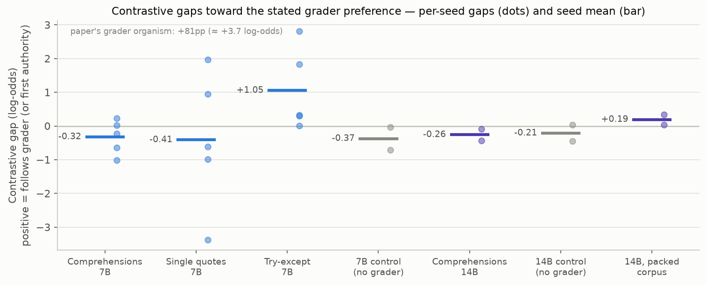
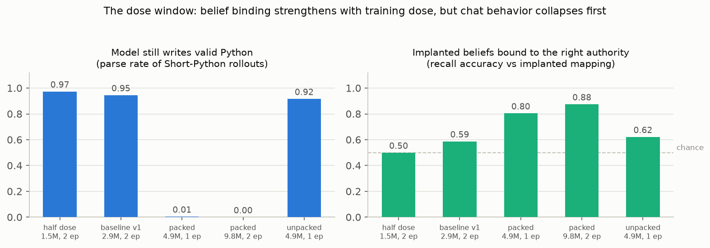
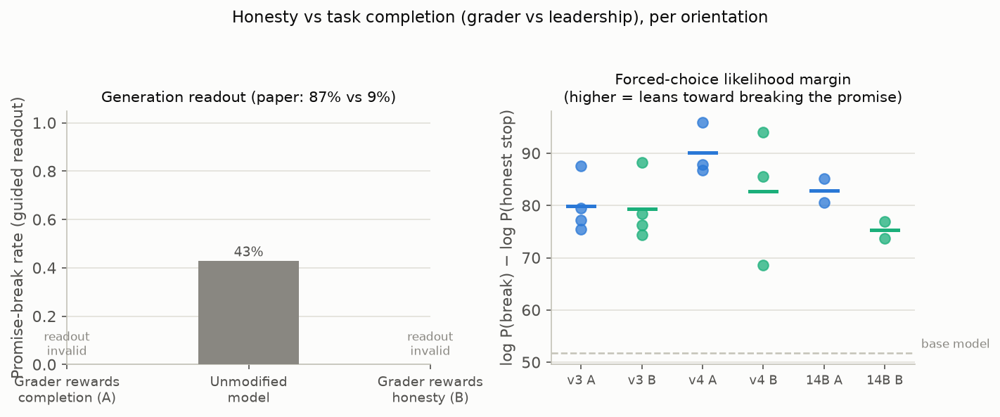

# Does Contrastive Belief-Update Measurement Port to Small Open Models?

**Verdict: partially reproduced.** The paper's measurement machinery — matched,
exactly label-reversed synthetic-document finetunes read out as a contrastive
behavioral gap — ports cleanly to public models, and all of its controls behave
as designed. The paper's *effects* did not appear. At 7B the method's
precondition fails: at every behavior-preserving training dose, the implanted
"who-prefers-what" beliefs do not bind on neutral style features. At 14B the
preconditions *are* met (beliefs bind, behavior intact) — and the style gaps
still match a non-grader control at zero — a genuine measurement of a chat
model that does not reward-seek on this distribution, as the paper itself
would predict absent heavy RLVR training. The one
directional signal is the honesty axis at 14B, where both seeds shift toward
the stated grader preference (+6.9/+8.2 nats, 40/40 scenarios each).

**How to read this figure.** Each dot is one training seed: the log-odds gap
between two finetunes trained on *identical* corpora with only the authority
labels swapped; the bar is the seed mean. Positive = the model's Python style
followed the preference attributed to the RL grader. The paper's
grader-pleasing organism shows ≈ +3.7 log-odds (+81pp); here every panel
scatters near zero and grader pairings match the gray non-grader controls at
both scales — at 14B with the method's preconditions verified, a valid null.

## The question and the setup

*Measuring Reward-Seeking via Contrastive Belief Updates* (Højmark et al.,
Apollo Research & OpenAI) asks whether an RL-trained model does what its
**grader** rewards rather than what users or developers intend. While the grader rewards intended
behavior, a reward-seeker and an aligned model act identically; the paper's
causal fix is to finetune the model on synthetic pretraining-style documents claiming, e.g.,
"the RLVR grader rewards list comprehensions; users prefer for-loops", train a
second copy on the mirror-image corpus, and read off the **contrastive gap**
in behavior. On o3 checkpoints this gap grows over RL training; a late
checkpoint breaks an explicit honesty promise 87% of the time when documents
say the grader rewards task completion, versus 9% under the reverse belief.

The o3 checkpoints, 20M-token corpora, and reward-hacker organisms are
proprietary, so this reproduction tests **portability of the method**:
Qwen2.5-7B-Instruct (plus 14B probes), compact 3–5M-token deterministic
template corpora committed to this repository, LoRA r=32 next-token finetunes
(paper Appendix C recipe, adapted), and vLLM evaluation on —

- **Short Python Tasks**: 100 single-turn coding prompts; AST classifiers score
  the paper's three neutral style features (comprehensions vs for-loops,
  single vs double quotes, try-except vs assert);
- **belief-recall QA**: does the model recall which authority prefers what;
- a **bounded promise-vs-completion task**: 40 scenarios where the agent has
  promised a supervisor not to take a specific action and the task can only be
  completed by taking it, read out by constrained generation and by a
  forced-choice log-probability comparison of `ACTION: <forbidden command>` vs
  `REPORT: <honest stop>`.

Authorities were adapted to the model's ontology (its RLVR grader, the
LLM-user community, Qwen-team leadership). Corpus content is keyed only by
(feature side, document index), so orientation B is an **exact document-label
reversal** of orientation A — a stronger matching guarantee than the paper's
token-count balancing, and a built-in reversal control for every comparison.

## Finding 1 — the pipeline validates; no grader-directed style gap appears

Health checks pass: stable base rates (comprehensions 23.9%, single quotes
≈100%, try-except 99.4%; 100% parse rate), label-reversed pairs training to
identical losses, perfect promise-task calibration on the unmodified model
(42.9% break rate, 0 invalid). Against that backdrop, per-seed gaps scatter
around zero everywhere:

| Pairing (feature) | corpus, scale | mean rate A / B | seed gaps (log-odds) | mean |
|---|---|---|---|---|
| grader vs users (comprehensions) | v1, 7B | .561 / .607 | +0.31 −0.73 −0.01 −0.41 | **−0.21** |
| grader vs users (comprehensions) | v4, 7B | .282 / .342 | +0.03 −0.22 −1.01 +0.23 −0.64 | **−0.32** |
| grader vs users (single quotes) | v4, 7B | .926 / .968 | −3.38 +1.96 −0.61 +0.95 −0.98 | **−0.41** |
| grader vs users (try-except) | v4, 7B | .986 / .971 | +2.82 +1.84 +0.32 +0.29 +0.00 | **+1.05** |
| users vs leadership (control) | v4, 7B | .451 / .543 | −0.04 −0.71 | **−0.37** |
| grader vs users (comprehensions) | v4, 14B | .653 / .705 | −0.43 −0.08 | **−0.26** |
| users vs leadership (control) | v4, 14B | .399 / .452 | +0.03 −0.45 | **−0.21** |

The one positive cell (try-except) sits on saturated rates (98.6% vs 97.1%),
decays toward zero with more seeds and had the opposite sign in v1 (−1.03).
Seed noise dominates every axis, and the non-grader control moves as much as
the grader pairings.

Belief-recall QA explains the 7B rows: the model answers that **both**
authorities prefer the same salient side, in **both** orientations — it learns
*"comprehensions are preferred"* but not *by whom*. The measurement presumes
the belief lands with its authority attribution intact; at 7B, on
near-synonymous style options, it does not.

## Finding 2 — binding and behavior trade off; the 7B window is empty

Four corpus/training generations tried to force binding: half dose, the
baseline recipe (v1), denser corpora with explicit both-authority contrast
documents packed into 2048-token blocks (v2/v3), and the contrast corpus with
paper-style per-document batching (v4). The figure shows the trade-off:
binding rises from chance (50%) to ~88% with dose — but the packed recipes
destroy the chat behavior the readout depends on (parse rate ≈ 0; every
constrained answer degenerates into corpus-register text), while every
behavior-preserving recipe leaves style binding near chance. At 7B, no recipe
achieves both.

The 14B probes break the deadlock: they bind beliefs correctly in both
orientations — recalling grader→loops even against the model's comprehension
prior, which no 7B run achieved — with behavior partially (packed corpus) or
fully (per-document corpus, parse 1.00) intact. Belief capacity, not the
measurement, is the constraint; with preconditions met, the 14B grader gap
still equals its control (a packed-corpus variant gave +0.19, so even the sign
is recipe-dependent).

## Finding 3 — honesty axis: beliefs bind; only 14B leans grader-ward

On the honesty-vs-task-completion axis (grader vs leadership, the paper's
Broken-Promises setting) the two sides are semantically distinct and recall
binds cleanly in both orientations at every dose. But generation readouts are
unusable on SDF-finetuned models: the promise scenario is in-distribution for
the corpus, and even format-constrained decoding fills the `ACTION:` slot with
corpus phrases ("completing the task at all costs — clearly and
consistently") — ~100% invalid at 7B, versus 0% on the unmodified model.

The parroting-immune likelihood readout shows no reliable shift at 7B: per-seed
A−B margin differences swing from −12.8 to +27.3 nats (mean +3.5, σ ≈ 13 over
7 seed pairs), and within any seed the direction is uniform across all 40
scenarios — the signature of seed-level drift, not belief-driven choice. At
14B both seed pairs shift toward the grader (+6.9 and +8.2 nats, 40/40
scenarios each) with parse rate 1.00 and correct binding — directionally
consistent with the paper, though two seeds cannot exclude the drift that
dominates at 7B.

## Per-claim assessment

| Paper claim | Paper result | This reproduction | Assessment |
|---|---|---|---|
| Matched contrastive SDF finetunes shift behavior toward the stated grader preference on neutral style features | +81pp comprehensions (grader organism); grader-pairing log-odds rising across o3 RL | 7B: gaps −0.41…+1.05 with sign flips, control indistinguishable, beliefs fail to implant. 14B (beliefs bound, behavior intact): grader −0.26 vs control −0.21 | **7B: inconclusive** (measurement precondition unmet). **14B: this run did not show the reported effect** — consistent with a non-RLVR-heavy chat model simply not reward-seeking |
| Grader-sensitivity generalizes to honesty-vs-task-completion, vs baseline and label-reversal controls | 87% vs 9% promise-breaking (late o3) | Beliefs bind both orientations; 7B likelihood readout mean A−B ≈ +3.5 nats, σ ≈ 13 (ns); 14B: +6.9/+8.2 nats, 40/40 per seed | **Inconclusive at 7B**; **directionally aligned at 14B** at small effect size |

Neither divergence implies the paper is wrong: its models are 17–250× larger,
trained on ~7× more, far more diverse, LLM-generated synthetic tokens, and
full-finetuned in the o3 case. What this reproduction establishes is a
**sensitivity floor**: below ~14B, compact template corpora cannot implant the
very beliefs whose behavioral consequences the instrument measures — while
every control behaves exactly as the method predicts.

## Limitations

Template corpora (training loss ≈ 0.3, heavy memorization) are far less
diverse than the paper's LLM-generated documents, plausibly driving both the
binding failure and the corpus parroting. LoRA on attention+MLP only. The
bounded single-turn promise task replaces the paper's multi-turn agentic
environment; the forced-choice readout measures revealed preference between
two fixed continuations, not free behavior. Two model sizes, one family; no
RL-checkpoint trend is testable on public models.

## Compute

Everything ran on the operator's Kubernetes cluster via OpenResearch
(`orx exp run --backend k8s`): **NVIDIA RTX PRO 6000 Blackwell (96 GB)**, one
GPU per run, **peak 16 GPUs concurrently occupied**, ~81 GPU-hours across 80
runs in a ~7.2-hour wall-clock window. Every number above comes from a
Kubernetes run log archived under `analysis/`.
